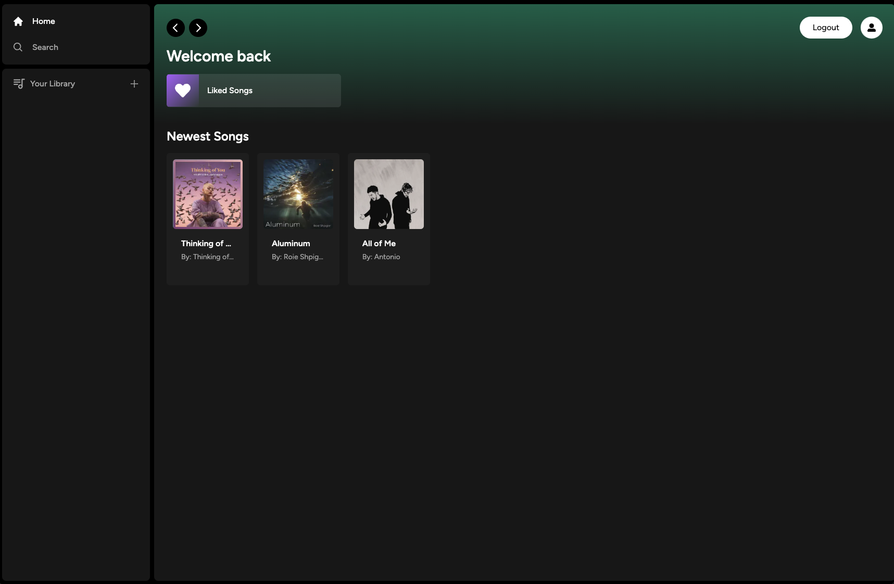

# About this App

This application is a Music app that allows users to upload music and play music in the cloud.

The UI is designed to mirror that of [Spotify](https://open.spotify.com/)

## Features

- Login/Authentication via Supabase
  - Authentication Options
    - Login with email/password
    - Login with Github
  - Login Option
    - Using Github
    - Using email/password
    - Magic link
  - Supports session creation
- Responsive UI
  - Dynamically renders components and adjust styles based on viewport
- Upload a song
  - uploads a song to cloud storage in supabase
- Like a song
  - Each user can manually like a song and have it added to "liked songs"
  - Must be an `.mp3` file
  - Must include a image to represent the album art
  - Form validation using `react-form-hook`
- Play a song
  - Users can stream a song from cloud storage in the browser
  - Supports next/previous/play/pause
- Search songs
  - Searching of songs based on their title
- Subscriptions using Stripe
  - Full features require monthly subscription on stripe

## Packages, Libraries and Services used

- `@radix/ui`
  - Accessible UI for dialogs (modals)
  - Accessible UI for sliders (used for volume slider)
- Supabase
  - Authentication
  - Cloud database (PostgreSQL)
    - stores:
      - user data
      - song data
      - product data
      - liked songs data
    - bucket/blob storage
      - albumn art (images)
      - songs (mp3 files)
- NextJS
  - Rendering (react)
    - client components
    - server components
  - API
    - sessions
    - portals
    - webhooks (stripe integration)
- Stripe (`stripe`)
  - Payments
  - Account Services
- Tailwind
  - CSS Styling
- TypeScript `tailwindcss`
  - Type checking
  - Merging styles (`tailwind-merge`)
- Dynamic State Management `zustand`
- Toast Notifications (`react-hot-toast`)
  - Success/failure notifications
- Song streaming `use-sound`
  - build on top of `Howler.js`

> This project was generated with `npx create-next-app` - Placeholder readme saved [here](./Next.README.md)
